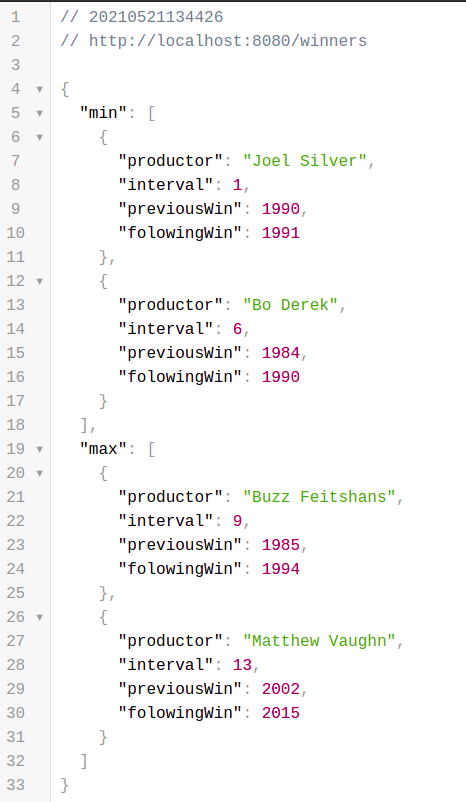

<div>
    <h1 align="center">API-Movies</h1>
</div>

## Sobre

- API-Movies - Possibilitar a leitura da lista de indicados e vencedores da
categoria Pior Filme do Golden Raspberry Awards.

## Tecnologias Utilizas
- [VScode](https://code.visualstudio.com/)
- [Spring-Boot](https://spring.io/projects/spring-boot)
- [Maven](https://maven.apache.org/)

## Como Fazer Download do Projeto
- Para realizar download e execuão do projeto em sua máquina favor seguir os seguintes procedimentos.
```bash
    # No console de seu computador navegar até a pasta onde desejar fazer o download do projeto e executar o comando abaixo:
    $ get clone https://github.com/ostrowskijr/api-movies.git

    # Após finalizar o clone do projeto acessar a pasta do projeto
    $ cd /api-movies

    # Se estiver utilizando o Vscode basta executar o comando abaixo para abrir o projeto na IDE.
    $ code .

    # O próximo passo é realizar o Donwload das dependências do projeto do repositório maven.
    $ mvn install

    # Após a finalizar as instalção podemos executar o projeto com o comando abaixo no terminal.
    $ mvn spring-boot:run

    # Após o projeto subir no servidor o mesmo vai estar acessivel através da url abaixo:
    $ http://localhost:8080/
```

## Acessando a Rota do Desafio proposto.
- O resultado do desafio proposto está acessivel através da rota abaixo:
    - http://localhost:8080/winners
    - Segue abaixo resultado da chamda no Chrome.
<div>
    
</div>

### Desevolvido por: Luis Antonio Ostrowski Jr - 05/2021.