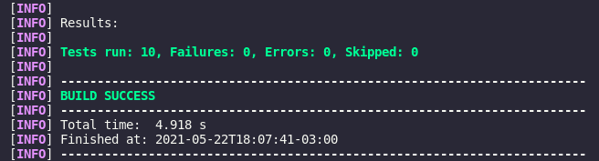

<div>
    <h1 align="center">API-Movies</h1>
</div>

## Sobre

- API-Movies - Possibilita a leitura da lista de indicados e vencedores da
categoria Pior Filme do Golden Raspberry Awards, contidos em arquivo teste no formato 'csv', armazenando em memória na aplicação para manipulação dos dados para obtenção do resultado proposto.

## Indice
- [Tecnologias Utilizadas](#tecnologias-utilizadas)
- [Como Realizar o Download do Projeto](#como-realizar-o-download-do-projeto)
- [Execução de Testes de Integração](#execução-de-testes-de-integração)
- [Rotas da Aplicação](#rotas-da-aplicação)
- [Resultado do Desafio](#resultado-do-desafio)
- [Desenvolvedor](#desenvolvedor)
## Tecnologias Utilizas
- [VScode](https://code.visualstudio.com/)
- [Java](https://www.java.com/pt-BR/)
- [Spring-Boot](https://spring.io/projects/spring-boot)
- [Maven](https://maven.apache.org/)

## Como Realizar Download do Projeto
- Para realizar download e execução do projeto em sua máquina favor seguir os procedimentos listados abaixo.
```bash
    # No console de seu computador navegar até a pasta onde desejar fazer o download do projeto e executar o comando:
    $ git clone https://github.com/ostrowskijr/api-movies.git

    # Após finalizar o clone do projeto acessar a pasta do projeto
    $ cd /api-movies

    # Se estiver utilizando o Vscode basta executar o comando abaixo para abrir o projeto na IDE.
    $ code .

    # O próximo passo é realizar o Donwload das dependências do projeto do repositório maven.
    $ mvn install

    # Após a finalizar as instalação das dependências, podemos executar o projeto com o comando abaixo no terminal.
    $ mvn spring-boot:run

    # Após o projeto subir no servidor o mesmo vai estar acessivel através da url abaixo:
    $ http://localhost:8080/
```
## Execução de Testes de Integração
- Para executar os testes de integração do projetos basta seguir os passos descritos baixo:
```bash
    # Através do console é possivel executar os teste com o comando abaixo:
    $ mvn test
```
Será lançado o resultado do testes no terminal conforme exemplo abaixo:

<div>
        
</div>

Ao final do teste será exibido o resultado do total de testes executados, conforme imagem abaixo:

<div>
        
</div>

## Rotas da aplicação
- http://localhost:8080/ - Index do projeto.
- http://localhost:8080/movies - Lista todos os filmes carregados do arquivo csv.
- http://localhost:8080/winners/list - Apresenta todos os produtores que venceram mais de 1 vez.
- http://localhost:8080/winners - Apresenta o resultado do desafio proposto.

## Resultado do Desafio
 - O resultado do desafio proposto está acessivel através da rota http://localhost:8080/winners, pode ser acessado através do navegador ou aplicativo de teste API de sua preferência como Postman ou Insommia.
    - Segue abaixo resultado da chamda no Google Chrome, o imagem já vem formatada devido extensão instalado no navegador para exebição de dados em formato Json.
<div>
    
</div>
 
### Desenvolvedor 
- Luis Antonio Ostrowski Jr - 05/2021.